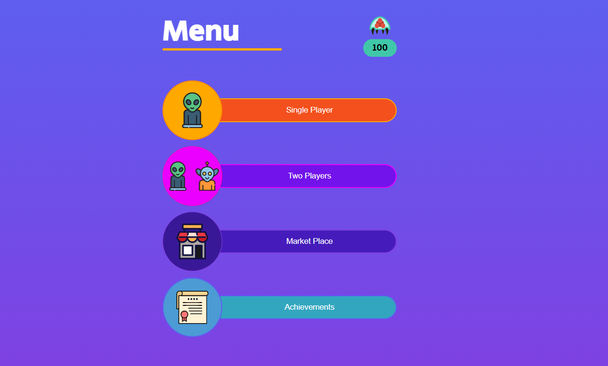
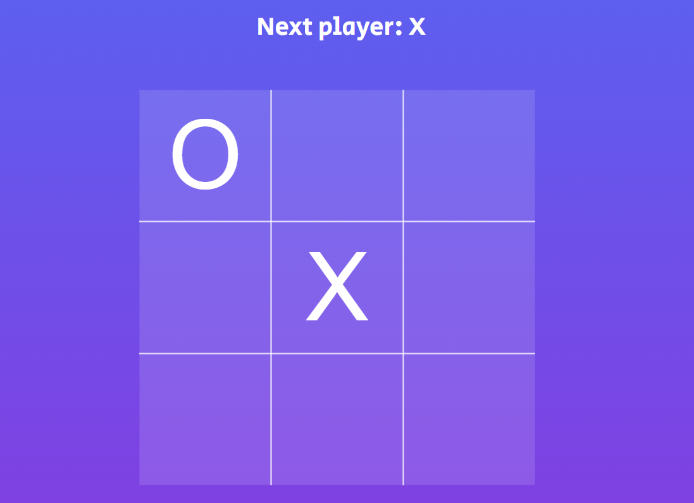
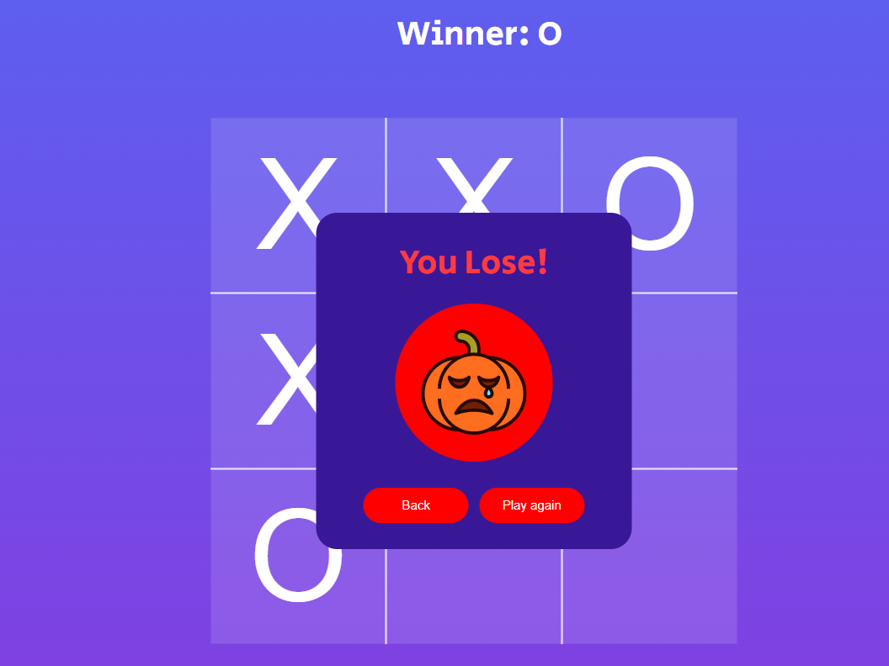

<h1 align="center">Tic Tac Toe</h1>
<h2 align="center"><a  href="https://toe-tac-tik.netlify.app/">Live Version</a></h2>

## Screenshots

<p align="center"></p>
<p align="center"></p>
<p align="center"></p>

 ## Project setup

```
npm install
npm start
```
